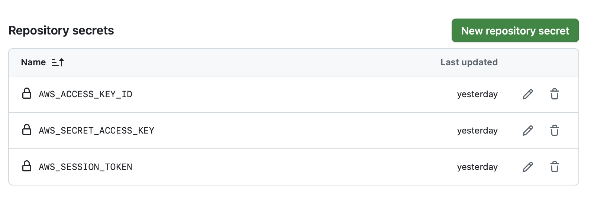

# ☁️ CloudNLP: Serverless RAG Chatbot on AWS

**Author:** Andrea Moschetto
**Course:** Cloud Systems
**Academic Year:** 2024/2025

---

## 📖 Technical Report Index
For an in-depth review of architectural choices, consult the following chapters:

1.  [**Introduction and Goals**](docs/01_intro_and_goals.md): Overview and technology stack.
2.  [**Cloud Architecture (Microservices on ECS)**](docs/02_cloud_architecture.md): Analysis of the Sidecar design pattern on AWS Fargate.
3.  [**The RAG Engine (Retrieval-Augmented Generation)**](docs/03_rag_engine.md): ChromaDB Client/Server, Embeddings, and LLM.
4.  [**Event-Driven Ingestion Pipeline**](docs/04_data_ingestion_events.md): From Telegram to S3, up to the Vector Store.
5.  [**Infrastructure as Code (Terraform)**](docs/05_infrastructure_as_code.md): AWS resource management.
6.  [**Security and Authentication**](docs/06_security_and_auth.md): Cognito, HTTPS, and Network Isolation.
7.  [**CI/CD & DevOps**](docs/07_cicd_and_devops.md): Automatic deployment pipeline with GitHub Actions.

---

## 🏛️ Architectural Overview

The project implements a hybrid **Cloud-Native** architecture (Container + Serverless) hosted on AWS.




```bash
cloud-nlp-project/
├── .github/
│   └── workflows/
│       └── deploy.yml          # CI/CD Pipeline for build and deploy on AWS
├── docs/                       # Project technical documentation
│   ├── 01_intro.md
│   ├── 02_architecture.md
│   └── ...
├── frontend/                   # UI Microservice (Chainlit)
│   ├── .chainlit/              # Chainlit configuration (Auth, UI settings)
│   ├── Dockerfile              # Frontend container definition
│   ├── app.py                  # UI, Chat, and Login logic
│   └── requirements.txt        # Lightweight Python dependencies
├── lambda/                     # Serverless Functions
│   ├── telegram_bot.py         # Telegram Bot Logic (Webhook)
│   └── trigger_ingestion.py    # Trigger S3 -> Orchestrator
├── orchestrator/               # API Gateway Microservice
│   ├── Dockerfile              # Orchestrator container definition
│   ├── main.py                 # API Endpoint (Traffic router)
│   ├── database.py             # Persistence logic (DynamoDB)
│   └── requirements.txt        # Dependencies (FastAPI, Boto3)
├── rag_service/                # Core Microservice (AI & Logic)
│   ├── data/                   # Temporary folder for PDF download
│   ├── Dockerfile              # RAG container definition (with PyTorch)
│   ├── main.py                 # Internal APIs (Ingest, Generate)
│   ├── ingest.py               # PDF processing and vectorization script
│   ├── retriever.py            # ChromaDB search logic
│   ├── generator.py            # Response logic (Gemini LLM)
│   ├── constants.py            # Environment variable configuration
│   └── requirements.txt        # Heavy dependencies (LangChain, Torch)
├── terraform/                  # Infrastructure as Code (IaC)
│   ├── main.tf                 # AWS Provider Setup
│   ├── network.tf              # VPC, Subnet, Security Groups
│   ├── ecs.tf                  # Fargate Cluster and Task Definitions
│   ├── alb.tf                  # Load Balancer and Target Groups
│   ├── dns.tf                  # Route53 and ACM Certificate
│   ├── cognito.tf              # User Auth Configuration
│   ├── s3.tf                   # Document Storage Bucket
│   ├── lambda*.tf              # Lambda Function Definitions
│   ├── variables.tf            # Input variable definitions
│   └── outputs.tf              # Useful outputs (site URL, etc.)
├── .env                        # Environment Variables (Local)
├── .gitignore                  # Files excluded from Git (tfvars, venv, etc.)
├── docker-compose.yml          # Orchestration for local testing
├── chainlit.md                 # Welcome message in chat
└── README.md                   # Main documentation
```

## 🚀 Installation and Deployment Guide

### Prerequisites

  * **AWS Account** (Learner Lab or Standard).
  * **Terraform** installed (`brew install terraform`).
  * **Docker** installed.
  * **Domain** registered (e.g., on Namecheap) and connected to an AWS Route53 Hosted Zone.
  * **TelegramBot** created with BotFather.

### 1\. Variable Configuration (`.env`)
You need to configure two different kind of variables: AWS credentials (for Terraform deploy and Github deploy) and API Keys.
   
#### Terraform secrets
First of all look for the aws session credentials in your dashboard, it must be something like that:
``` text
[default]
aws_access_key_id=AIOEFNADKADFIEJF1423
aws_secret_access_key=3sijf/hdauboOkddhsiam
aws_session_token=IQoJb3JpZ2luX2VjEJf//////////wEaCXVzLXdlc3QtMiJHME...
```
Copy the entire text and save it as a file called `~/.aws/credentials` so that terraform can deploy the cloud infrastructure in the correct aws account.

#### Github secrets
To deploy the code, Github needs these secrets too, so save it as three different repository secrets:
Go to `Settings > Secrets and variables > Actions > New repository secret `.


#### API Keys
Navigate to the `terraform/` folder, create a `terraform.tfvars` file (ignored by git) and save your google api key from the gemini dashbord, the telegram bot token given by BotFather and a random string used by chainlit authentication. Like so:
```bash
google_api_key       = "SIEjns..."
telegram_token       = "bfc4123di..."
chainlit_auth_secret = "RandomSecretAlphaNumericString"
``` 

### 2\. Infrastructure Deployment (Terraform)
```bash
cd terraform
terraform init
terraform apply
```
*Confirm with `yes`. Wait 5-10 minutes for ACM certificate validation.*

Upon completion, Terraform will return the necessary outputs (ECR URLs, Cognito ID, S3 Bucket). **If you are doing a local test update the local `.env` file with these values. Otherwise  ignore it**

### 3\. Application Deployment (GitHub Actions)

Push to the `main` branch. The CI/CD pipeline will activate automatically:

1.  Build Docker images.
2.  Push to Amazon ECR.
3.  Force deployment on ECS ("Rolling Update").

### 4\. Telegram Bot Setup

On the first deploy, Terraform automatically configures the Webhook.
Open the bot on Telegram and send `/start`.

-----

## 🤖 User Guide

### Web Access

1.  Visit `https://am-cloudnlpchatbot.site`.
2.  Log in via AWS Cognito (Email/Password).
3.  Start chatting.

### Document Management (Telegram)

The bot allows managing the Knowledge Base on the go:

  * **Upload:** Send a PDF file directly in the chat.
  * **List Files:** Send the `/list` command.
  * **Deletion:** Send `/delete filename.pdf`.

Every operation sends a real-time notification regarding the ingestion status.