# Cloud NLP Chatbot ☁️🤖

University project for the Cloud Systems course. A RAG (Retrieval Augmented Generation) chatbot distributed on AWS using a microservices architecture.

## 🌟 Features

  - **Smart Chat:** Answers questions based on PDF documents.
  - **Persistent Memory:** Saves conversation history on DynamoDB.
  - **Authentication:** Secure login via AWS Cognito.
  - **Automatic Ingestion:** PDF upload via S3 or Telegram Bot with automatic triggers.
  - **Infrastructure as Code:** Fully deployed via Terraform.

## 🏛️ Architecture

The system follows the Microservices pattern on AWS Fargate containers.



### Main Components

1.  **Frontend (Chainlit):** Interactive user interface.
2.  **Orchestrator (FastAPI):** Internal API Gateway, manages business logic and history.
3.  **RAG Service:** The "brain". Manages embeddings (HuggingFace), the Vector Store (ChromaDB), and generation (Google Gemini).
4.  **Ingestion Pipeline:** S3 -\> Lambda -\> RAG Service for real-time updates.

## 🛠️ Installation and Deploy

### Prerequisites

  - AWS CLI configured
  - Terraform
  - Docker
  - GitHub Account

### 1. Local Development

```bash
# Create the .env file
cp .env.example .env
# Start with Docker Compose
docker-compose up --build
```

### 2. AWS Deployment

The infrastructure is managed by Terraform.

```bash
cd terraform
# Initialize
terraform init
# Apply (creates ALB, ECS, Cognito, DB, S3)
terraform apply
```

The CI/CD pipeline (GitHub Actions) will automatically build and push Docker images to ECR on every push.