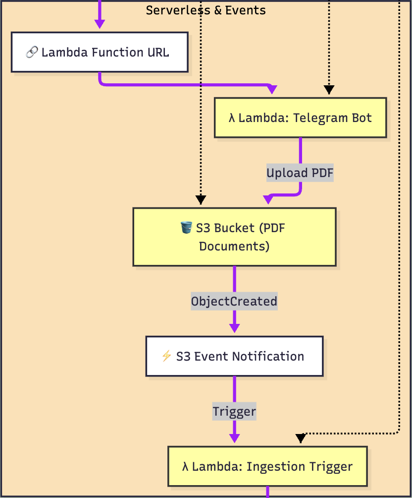

# 4. Event-Driven Ingestion Pipeline

One of the distinctive features of the project is the asynchronous and multi-channel ingestion pipeline.

## The Data Flow
The goal is to allow the user to upload a document and make it "searchable" by the chatbot without blocking the main interface.

### Channel 1: Telegram Bot (Mobile)
A Telegram bot acts as a remote input interface.
1.  The user sends a PDF to the bot.
2.  Telegram invokes a **Lambda Function** (`telegram_bot.py`) via Webhook.
3.  The Lambda downloads the file and uploads it to **Amazon S3**, attaching metadata (e.g., user `chat_id`).

### Channel 2: Automatic S3 Trigger
The S3 bucket acts as the "Source of Truth" and trigger for processing.
1.  The `s3:ObjectCreated` event activates a second Lambda (`trigger_ingestion.py`).
2.  This Lambda sends an HTTP `POST /ingest-s3` request to the Orchestrator (via ALB).
3.  The Orchestrator forwards the request to the **RAG Service**.

### Background Processing
The RAG Service receives the request and leverages `FastAPI BackgroundTasks` to not block the HTTP response.
1.  Downloads the file from S3.
2.  Launches an isolated **subprocess** to calculate embeddings (preventing memory leaks).
3.  Writes vectors to the **ChromaDB Server**.
4.  Notifies the user on Telegram of successful completion.

This design ensures that heavy file ingestion never slows down the chat for other users.

---

[← Previous Chapter](03_rag_engine.md) | [🏠 Back to Home](../README.md) | [Next Chapter: Terraform (IaC) →](05_infrastructure_as_code.md)

